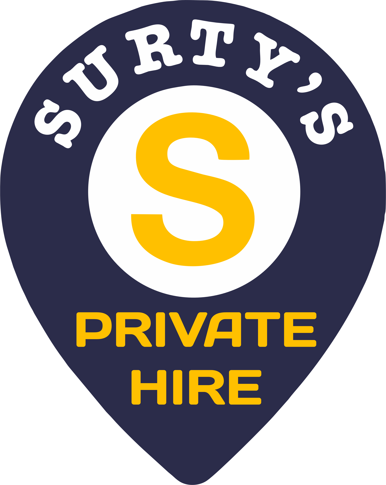

# Surty's Private Hire



## Overview

Surty's Private Hire is a professional taxi and mini-bus service website for a Gloucester-based company. The website showcases the company's services, allows customers to book rides, view taxi fares, and contact the business directly.

## Live Site

[https://www.surtysprivatehire.co.uk/](https://www.surtysprivatehire.co.uk/)

## Features

- **Responsive Design:** Fully mobile-responsive layout that works on all devices
- **Online Booking:** User-friendly booking form for customers to request rides
- **Fare Information:** Transparent pricing with detailed fare tables
- **Testimonials:** Customer reviews and testimonials
- **Awards Showcase:** Display of company achievements and awards
- **Interactive Map:** Location information with interactive map
- **Contact Form:** Direct messaging system for customer inquiries
- **Animations:** Subtle animations to enhance user experience

## Technologies Used

- **React.js:** Frontend framework
- **Tailwind CSS:** Utility-first CSS framework for styling
- **DaisyUI:** Component library for Tailwind CSS
- **EmailJS:** Client-side email sending
- **Framer Motion:** Animation library
- **Swiper/Keen-slider:** Carousel and slider components
- **Leaflet:** Interactive maps
- **React Hot Toast:** Toast notifications
- **AOS:** Animate on scroll library

## Installation and Setup

1. **Clone the repository:**

   ```bash
   git clone [repository-url]
   cd surtys-taxi
   ```

2. **Install dependencies:**

   ```bash
   npm install
   ```

3. **Run development server:**

   ```bash
   npm run dev
   ```

4. **Build for production:**
   ```bash
   npm run build
   ```

## Project Structure

- **`/src`**: Source files
  - **`/assets`**: Static assets (images, animations)
  - **`/components`**: Reusable React components
  - **`/layout`**: Layout components
  - **`/pages`**: Page components

## Deployment

The project is configured for deployment with Firebase Hosting:

```bash
# Install Firebase CLI if you haven't already
npm install -g firebase-tools

# Login to Firebase
firebase login

# Deploy to Firebase
firebase deploy
```

## Services

Surty's Private Hire offers various services including:

- Airport transfers
- Seaport transfers
- Tours in Gloucester and surrounding areas
- Event transportation
- Business travel
- School and hospital runs
- Wheelchair accessible vehicles
